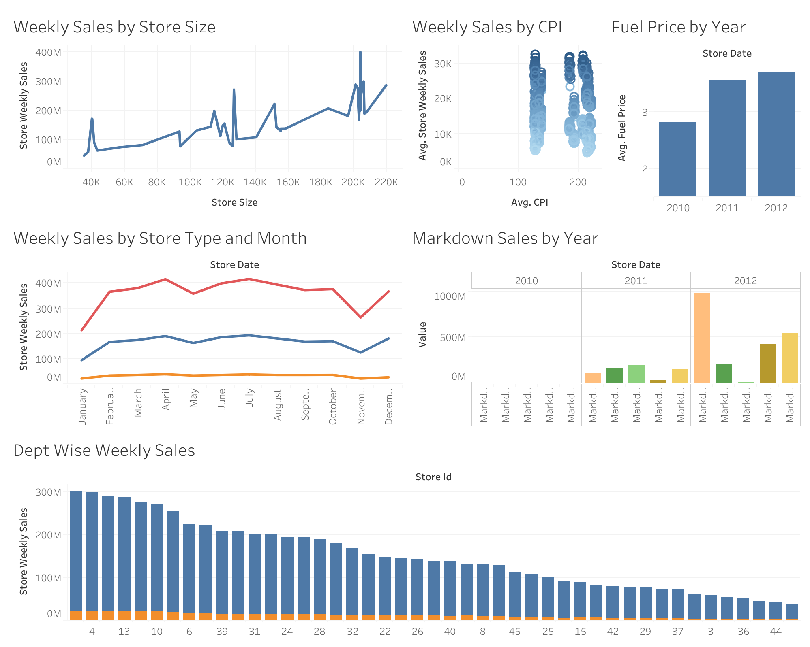

# Walmart End-to-End Data Engineering Project

End-to-end data engineering project using AWS S3, Snowflake, dbt, Python, and Tableau. Implements Bronze → Staging → Mart architecture with SCD Type 1 &amp; Type 2 dimensional modeling and interactive business reporting.

## Overview

Built an end-to-end data engineering pipeline using:

- AWS S3
- Snowflake
- dbt
- Python
- Tableau Public

## Repository Structure

dbt/        dbt models, macros, and project configuration
sql/        Snowflake setup, stage, COPY INTO, and validation scripts
images/     Architecture diagram and dashboard screenshots
README.md   Project overview and documentation

## Architecture

## Data Pipeline

CSV Files
→ AWS S3
→ Snowflake Bronze Layer
→ dbt Staging Layer
→ Dimension & Fact Tables
→ Tableau Dashboard

## Data Model

### Walmart_Date_Dim
- Date_ID
- Store_Date
- IsHoliday

### Walmart_Store_Dim
- Store_ID
- Dept_ID
- Store_Type
- Store_Size

### Walmart_Fact_Table
- Store_Weekly_Sales
- Fuel_Price
- CPI
- Markdown1-5

## Tableau Dashboard

Live Dashboard:

[View Tableau Dashboard](https://public.tableau.com/authoring/E2EWalmartProject-AnthonyAmabile/WeeklySalesbyCPI/Summary%20Dashboard#1)

## Dashboard Sample

## Results

Successfully built:

- AWS S3 ingestion pipeline
- Snowflake Bronze Layer
- dbt staging models
- SCD Type 1 dimensions
- SCD Type 2 fact table
- Tableau dashboards

Processed:
- Sales Data
- Store Data
- Macroeconomic Data

Generated:
- Date Dimension
- Store Dimension
- Fact Table

## Skills Demonstrated

- AWS S3
- Snowflake
- SQL
- dbt
- Dimensional Modeling
- SCD1
- SCD2
- Python
- Tableau
